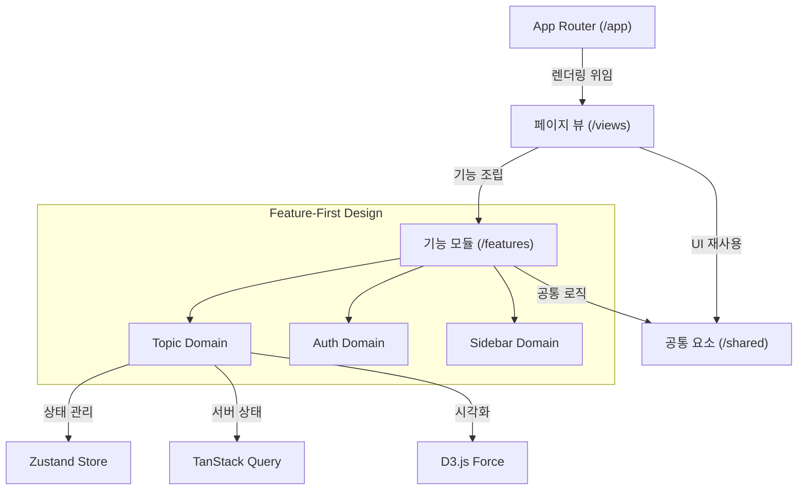
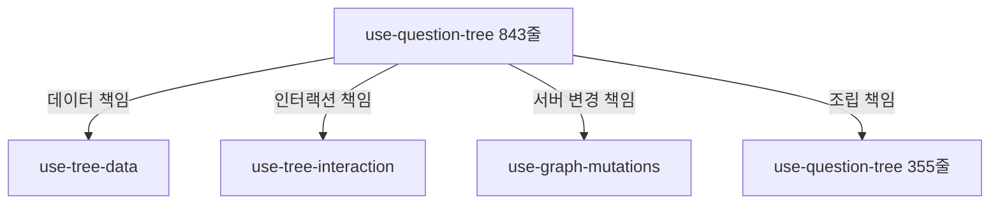
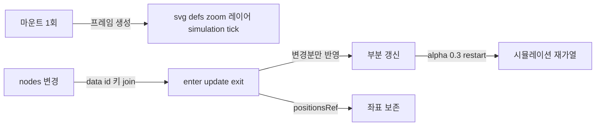
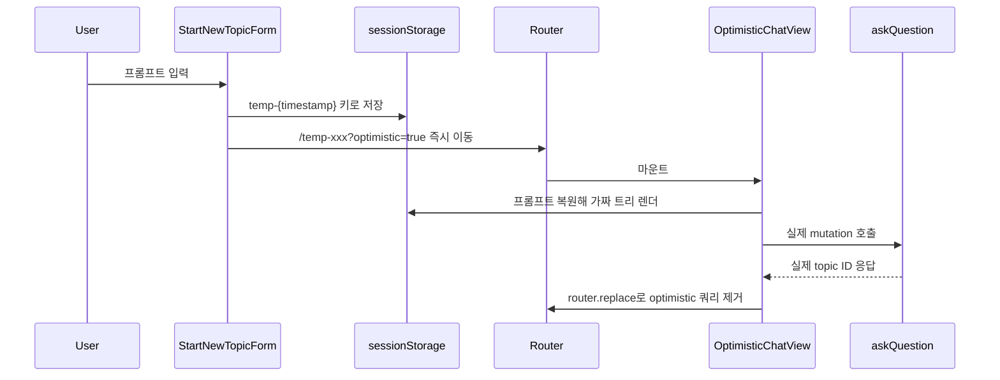
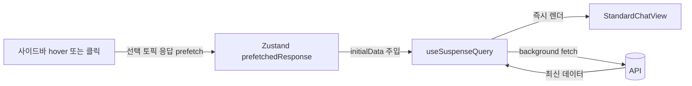

## [chatGraph] - AI 대화 시각화 플랫폼

기존 선형 채팅 UI에서는 한 갈래 흐름만 살아남고 도중에 떠올린 분기 질문과 맥락이 휘발되어, 깊이 있게 사고를 확장하려는 사용자가 이전 맥락을 다시 짜맞춰야 하는 비용이 컸습니다.
chatGraph는 비선형 사고 흐름을 보존하려는 학습자와 리서처를 위해 AI와의 대화를 꼬리물기 그래프로 시각화합니다. 분기와 깊이를 잃지 않고 사고를 확장하도록 돕습니다.

### 전체적인 아키텍처

- Next.js App Router 위에 Feature-First 디렉토리 구조를 적용해 도메인 기능과 페이지 조립, 공통 자원을 분리했습니다.
- 본인은 FE 2명 중 1명으로 참여했으며, 아키텍처 재정비, 새 토픽 Optimistic 흐름, useSuspenseQuery 기반 데이터 패칭, 뷰 컴포지션 분리, 테스트 코드 작성을 담당했습니다.
- D3 기반 그래프 시각화의 색상 알고리즘과 호버 인터랙션은 팀원이 주도했고, 본인은 React 통합과 D3 데이터 조인 기반 부분 갱신을 담당했습니다.

### Case 1. Feature-First 디렉토리 도입과 거대 훅 분해
#### 1. 문제 원인
- 초기 구조에서는 페이지, 기능, 공통 코드의 경계가 모호하여 컴포넌트끼리 서로를 직접 import하는 순환 참조가 반복 발생했습니다.
- 트리 상태와 인터랙션을 모두 끌어안은 use-question-tree 훅이 843줄까지 비대해져 변경 시 영향 범위 파악이 어려웠습니다.

#### 2. 해결 과정

- app은 라우팅, features는 도메인, views는 조립, shared는 공통이라는 네 가지 책임으로 디렉토리를 재정의하고 import 방향을 단방향으로 정비했습니다.
- 단일 훅이 들고 있던 책임을 트리 데이터(use-tree-data), 인터랙션 상태(use-tree-interaction), 서버 변경(use-graph-mutations)으로 분리하고 최상위에서 합성하는 형태로 정리했습니다.
- 단일 PR이 아닌 본인 단독 커밋 3건에 걸친 누적 리팩토링으로 진행해 위험을 분산했습니다.

#### 3. 결과
- 핵심 훅을 843줄에서 355줄로 축소하고 인접한 페이지 컴포넌트도 186줄에서 59줄로 정리하여 도메인별 책임을 명확히 했습니다.
- 기능 추가 시 어떤 디렉토리에 어떤 파일이 들어가야 하는지에 대한 팀 내 합의가 잡혀 신규 기능 머지 충돌 빈도가 줄었습니다.
- 디렉토리 재정의 작업을 통해 모듈 간 import 방향을 단방향으로 고정해야 신규 기능이 기존 도메인을 침범하지 않는다는 작업 기준을 팀과 공유했습니다.

### Case 2. D3 데이터 조인으로 시각화 부분 갱신
#### 1. 문제 원인
- 초기 visualizer는 토픽이 바뀌거나 트리가 갱신될 때마다 `d3.select(svgRef).selectAll("*").remove()`로 SVG 하위 트리를 통째로 비운 뒤 그래프를 처음부터 다시 그렸습니다.
- 전체를 다시 그리는 방식이라 노드 하나만 추가되거나 삭제돼도 시뮬레이션이 새로 시작돼 기존 노드 좌표가 초기화됐고, defs 필터와 zoom, force simulation까지 매 갱신마다 재생성됐습니다.

#### 2. 해결 과정

- svg 프레임과 defs(필터), zoom, 레이어, forceSimulation, tick은 마운트 시 1회만 생성해 재사용하도록 분리하고, 매 갱신마다 재생성하던 코드를 걷어냈습니다.
- 데이터가 바뀌면 `.data(nodes, d => d.data.id).join(...)`으로 노드 id를 키 삼아 enter, update, exit를 구분해 변경, 추가, 삭제된 노드만 DOM에 반영했습니다.
- 기존 노드는 positionsRef에 좌표를 보존해 join 시 그대로 복원하고, simulation.nodes와 forceLink.links를 갱신한 뒤 alpha(0.3)으로 restart해 바뀐 부분만 재배치했습니다.
- selectAll().remove()는 언마운트 cleanup에서만 1회 호출하도록 옮겨, StrictMode 이중 마운트에서도 키 조인이 안전하게 동작하도록 했습니다.
- 색상 알고리즘과 호버 desaturate 같은 시각적 인터랙션은 팀원이 작성한 코드를 유지하고, 본인은 React 통합과 데이터 조인 재설계에 집중했습니다.

#### 3. 결과
- 노드를 추가하거나 삭제해도 변경된 노드만 갱신되고 나머지 노드는 좌표를 유지해, 토픽 갱신 때마다 그래프가 처음부터 다시 그려지며 화면이 튀던 현상이 사라졌습니다.
- 데이터 조인으로 갱신 책임을 키 기준으로 정리하니, 프레임과 시뮬레이션은 1회 마운트로 재사용하고 데이터 변경만 부분 반영하는 구조가 잡혀 StrictMode 이중 마운트에서도 잔여 DOM이 남지 않았습니다.

### Case 3. 새 토픽 생성 시 LLM 응답 대기 가리기
#### 1. 문제 원인
- 메인 화면에서 첫 질문을 입력하면 LLM 응답이 도착할 때까지 화면이 정지된 듯한 경험이 사용자 몰입을 끊었습니다.
- 토스트나 스피너만 띄우는 방식은 새 토픽이 생성될 URL을 미리 보여주지 못해 뒤로가기와 새로고침 동작이 어색했습니다.

#### 2. 해결 과정

- StartNewTopicForm에서 temp-{Date.now()} 형태의 임시 ID를 만들어 sessionStorage에 프롬프트를 보관한 뒤 즉시 해당 경로로 push하도록 흐름을 설계했습니다(use-start-new-topic.ts).
- 이동한 경로에서는 useOptimisticTopicData 훅이 sessionStorage 데이터를 복원해 한 단계짜리 트리를 즉시 렌더링하고 동시에 실제 mutation을 실행합니다.
- mutation 성공 시 Zustand 스토어에 응답을 채워 두고 router.replace로 optimistic 쿼리 파라미터를 제거하여 실제 topic ID 경로로 자연스럽게 정착시켰습니다.

#### 3. 결과
- LLM 응답까지의 대기 시간 동안에도 사용자가 자신이 입력한 질문이 그려진 화면을 즉시 볼 수 있어 체감 대기 시간이 줄었습니다.
- 임시 URL과 실제 URL의 전환을 사용자에게 노출하지 않도록 처리해 새로고침이나 공유 링크 동작도 정상적으로 유지했습니다.
- 라우팅, sessionStorage, mutation 라이프사이클을 한 흐름으로 묶어 두니 LLM 응답까지의 대기 시간이 새 화면 진입 직후 사용자가 자신의 입력을 보는 시간으로 바뀌었습니다.

### Case 4. 라우트 전환 시 빈 화면을 없애는 프리패치 패턴
#### 1. 문제 원인
- 사이드바에서 다른 토픽을 클릭하면 useQuery가 새로 호출되며 페이지가 잠시 빈 상태로 보였습니다.
- App Router의 Suspense fallback이 노출되며 깜빡임이 발생했고, 데이터 양이 많은 토픽일수록 체감 지연이 커졌습니다.

#### 2. 해결 과정

- 사이드바에서 토픽 응답을 미리 받아 Zustand 스토어의 prefetchedResponse 슬롯에 저장하도록 했습니다.
- 페이지 진입 시 useSuspenseQuery의 initialData에 동일 topicId의 프리패치 응답이 있으면 그대로 사용하고(use-topic-data.ts), 없을 때만 Suspense fallback을 거치도록 분기했으며, 다음 단계에서 백엔드 응답을 transformApiDataToViewData 어댑터로 트리 형태로 변환해 주입했습니다(use-tree-data.ts).
- 사용한 프리패치 데이터는 effect에서 정리해 다음 토픽 전환 시 잔여 데이터가 섞이지 않도록 했습니다.

#### 3. 결과
- 사이드바 기반 라우트 전환에서 빈 화면 노출 없이 트리가 즉시 그려지는 흐름을 확보했습니다.
- TanStack Query 캐시와 Zustand 스토어 두 계층을 모순 없이 결합하는 방법을 익혔고, fallback이 보이는 케이스를 의도적으로 좁히는 설계 감각을 갖게 되었습니다.
