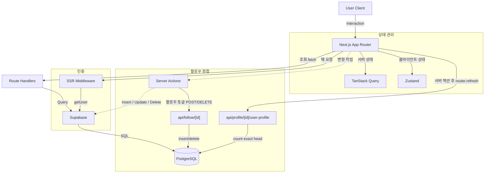
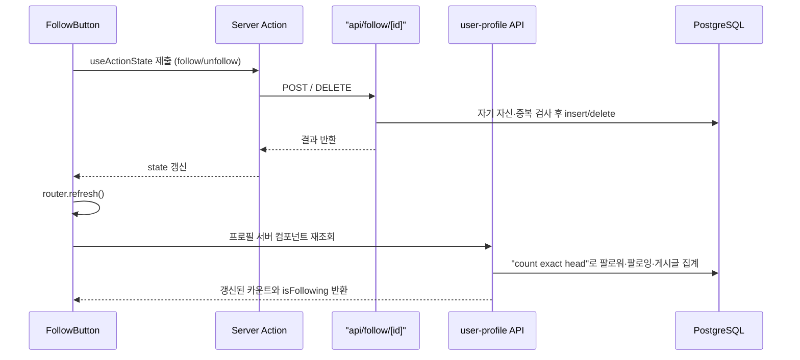
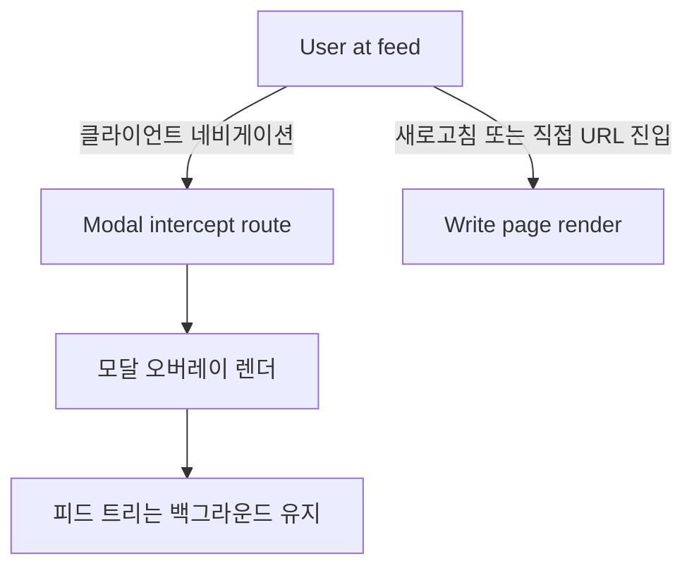
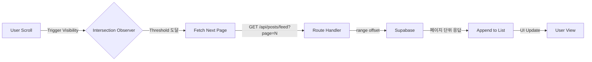

## [xAB] - 실시간 투표 및 소통 중심의 A/B 테스트 SNS

### 전체적인 아키텍처

- Next.js App Router 기반 프론트엔드와 Supabase 백엔드를 결합하여 구축했습니다.
- 조회성 요청은 클라이언트 컴포넌트가 Route Handler를 호출해 Supabase에 접근하는 경로로 처리하고, 게시글 작성·수정·삭제 같은 변형 작업은 Server Actions가 Supabase를 직접 호출하도록 두 경로를 명확히 분리했습니다.
- 서버 상태는 TanStack Query, 클라이언트 전역 상태는 Zustand로 책임을 분리하여 SNS 환경에서도 캐시 일관성과 사용자 인터랙션 상태를 분리된 경로로 관리했습니다.

### Case 1. 팔로우 토글과 프로필 카운트 정합을 맞춘 API 설계
#### 1. 문제 원인
- 팔로우 버튼을 누른 직후에도 프로필 헤더의 팔로워·팔로잉 수가 그대로 남아, 버튼 상태와 카운트 표시가 어긋나 보이는 문제가 있었습니다.
- 팔로우 관계는 `follows` 테이블의 `follower_id`·`following_id` 두 컬럼으로만 표현되는데, 자기 자신을 팔로우하거나 같은 관계를 중복 삽입하면 카운트가 실제 관계보다 부풀려질 여지가 있었습니다.
- 팔로워 수·팔로잉 수·게시글 수를 화면마다 따로 조회하면 같은 사용자 정보가 호출 시점에 따라 다르게 보일 수 있어, 한 사용자에 대한 집계를 한 경로로 모을 필요가 있었습니다.

#### 2. 해결 과정

- 팔로우 토글 API(`app/api/follow/[id]/route.ts`)는 POST로 팔로우를 추가하고 DELETE로 해제하도록 분리했고, 두 메서드 모두 `supabase.auth.getUser()`로 요청자를 확인한 뒤 `follower_id`를 서버에서 채웠습니다.
- 요청자 ID와 대상 ID가 같으면 400으로 막아 자기 자신 팔로우를 서버에서 차단하고, 대상 사용자가 `users` 테이블에 없으면 404를 반환하도록 했습니다. POST는 기존 관계를 먼저 조회해 이미 팔로우 중이면 삽입을 생략하여 중복 행이 쌓이지 않게 했습니다.
- 프로필 조회 API(`app/api/profile/[id]/user-profile/route.ts`)는 게시글 수·팔로워 수·팔로잉 수를 모두 `select('id', { count: 'exact', head: true })`로 한 번에 집계하고, 로그인 사용자가 대상을 팔로우 중인지(`isFollowing`)까지 같은 응답에 담아 한 경로에서 카운트와 버튼 상태가 같은 기준으로 계산되게 했습니다.
- 클라이언트(`FollowButton`)는 서버 액션을 `useActionState`로 호출하고, 반환된 state가 바뀌면 `router.refresh()`로 프로필 서버 컴포넌트를 다시 그려 토글 직후 카운트와 버튼 상태를 함께 갱신했습니다.
- 팔로워 목록 API는 각 팔로워에 대해 요청자가 맞팔로우 중인지 역방향으로 한 번 더 조회해 목록의 팔로우 버튼 상태(`isFollowing`)를 함께 내려, 목록과 프로필 헤더가 같은 관계 데이터를 보게 했습니다.

#### 3. 결과
- 팔로우·언팔로우 직후 `router.refresh()`로 프로필 서버 컴포넌트를 재조회하도록 연결한 결과, 버튼 상태와 팔로워·팔로잉 카운트가 한 번의 동작으로 함께 바뀌어 둘이 어긋나 보이던 화면이 사라졌습니다.
- 자기 자신 팔로우를 400으로 막고 POST에서 기존 관계를 먼저 확인하도록 두니, 자기 참조 관계나 중복 행으로 카운트가 부풀려질 경로가 없어졌습니다.
- 게시글 수·팔로워 수·팔로잉 수·`isFollowing`을 한 API에서 `count: 'exact'` 집계로 묶어 내려, 프로필 헤더와 팔로워 목록이 같은 호출 기준으로 같은 수치를 보게 됐습니다.

### Case 2. 피드 맥락을 유지하는 모달 라우팅 패턴 적용
#### 1. 문제 원인
- 피드에서 게시글 작성이나 상세 화면으로 이동할 때 전체 페이지가 다시 렌더되면서 스크롤 위치와 진행 중이던 인터랙션이 모두 초기화되는 문제가 있었습니다.
- 기존 라우팅 방식은 페이지 컨텍스트를 완전히 교체하기 때문에 이전 화면의 상태를 유지한 채 상호작용할 수 없는 구조적 한계가 원인이었습니다.

#### 2. 해결 과정

- 탐색 흐름을 유지하기 위해 피드 트리는 그대로 두고 그 위에 모달을 띄우는 방식을 채택했습니다.
- Next.js App Router의 병렬 라우트 슬롯(`@modal`)과 인터셉팅 라우트(`(.)write`)를 함께 배치하여, 클라이언트 네비게이션 시에는 모달 오버레이가 렌더되고 직접 URL 진입이나 새로고침 시에는 독립 페이지가 렌더되는 구조를 만들었습니다.
- `@modal/default.tsx`에 빈 슬롯 폴백을 두어 슬롯이 활성화되지 않은 라우트에서도 트리가 정상적으로 렌더되도록 처리했습니다.

#### 3. 결과
- 게시글 작성과 상세 진입 시 피드 위치와 스크롤 컨텍스트가 보존되어 탐색이 끊기지 않는 경험을 제공했습니다.
- 모달 진입과 독립 페이지 진입을 같은 URL로 처리할 수 있어 공유 링크나 새로고침 시에도 일관된 화면을 보장했습니다.
- 병렬 라우트 슬롯(`@modal`)과 인터셉팅 라우트(`(.)write`)를 함께 배치한 결과, 같은 URL이 클라이언트 네비게이션에서는 모달로, 새로고침과 공유 링크에서는 독립 페이지로 렌더되어 진입 방식과 무관하게 일관된 화면을 제공했습니다.

### Case 3. 피드 초기 로딩 지연을 해소하는 지연 로딩 전략
#### 1. 문제 원인
- 메인 피드 접속 시 게시글, 투표 옵션, 댓글 수, 좋아요 정보를 한 번에 불러오는 구조에서는 첫 화면 진입 시 응답 페이로드와 렌더링 비용이 크게 누적되었습니다.
- 뷰포트 밖에 있는 게시글까지 동일한 비중으로 페칭과 렌더링을 수행하면서 초기 화면이 그려지기까지의 체감 지연이 발생했습니다.

#### 2. 해결 과정

- 사용자가 즉시 보지 않는 데이터까지 한 번에 호출하는 대신 피드를 페이지 단위로 분할하여 호출하는 전략을 수립했습니다.
- `useInfiniteQuery`로 페이지네이션 상태를 관리하고, `react-intersection-observer`로 뷰포트 하단 트리거 요소의 노출 시점을 감지해 다음 페이지를 가져오도록 구현했습니다.
- Route Handler는 `page` 쿼리 파라미터를 받아 Supabase의 `.range(offset, offset + limit - 1)` 메서드로 페이지 단위 응답만 반환하도록 구성하여 서버와 클라이언트가 동일한 분할 단위를 공유하게 했습니다.

#### 3. 결과
- 초기 진입 시 필요한 데이터만 우선 응답하도록 변경하여 첫 화면이 그려지기까지의 체감 지연을 완화했습니다.
- 스크롤 위치에 따라 점진적으로 데이터를 채워 사용자의 탐색 흐름이 끊기지 않는 무한 스크롤 경험을 제공했습니다.
- `useInfiniteQuery`와 Intersection Observer, Supabase `.range(offset, offset + limit - 1)`를 한 페이지 분할 단위로 묶어 두니, 뷰포트 밖 게시글 페칭과 렌더링 비용이 사라지고 첫 화면 진입 직후 사용자가 보는 콘텐츠가 응답 직후에 채워졌습니다.
