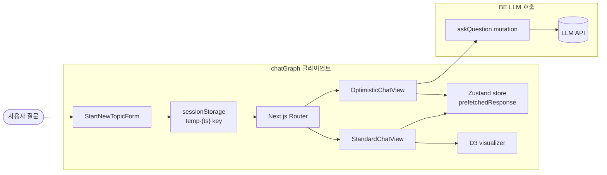
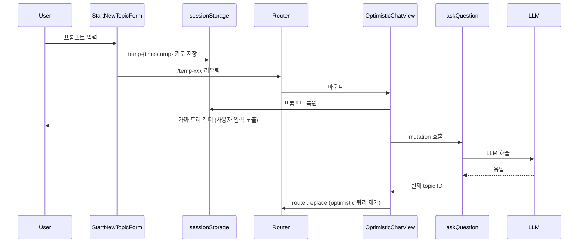
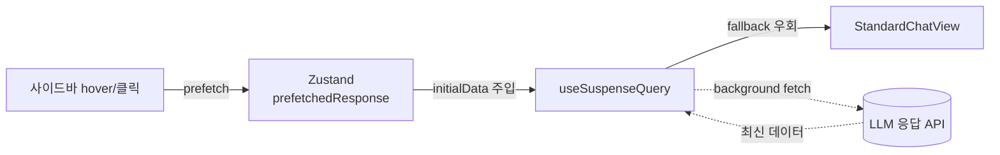
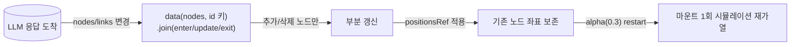
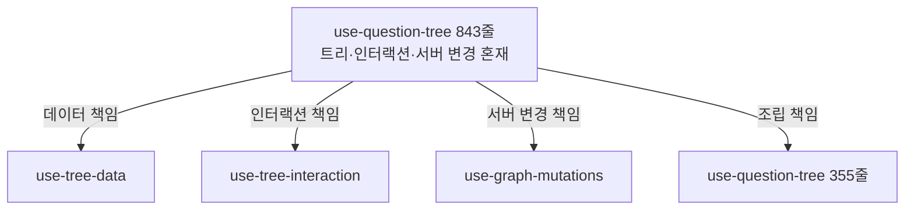

## [chatGraph] - AI 대화 시각화 플랫폼

기존 선형 채팅 UI에서 한 갈래 흐름만 살아남고 도중에 떠올린 분기 질문·맥락이 휘발되어 사용자가 이전 맥락을 다시 짜맞춰야 하는 비용이 컸습니다. chatGraph는 LLM과의 대화를 꼬리물기 형태의 그래프로 시각화하여 분기와 깊이를 보존하는 LLM 응답 통합 솔루션입니다. 본인은 4인 팀의 FE 한 명으로 참여해 LLM 응답 대기 동안의 사용자 흐름과 응답을 시각화로 연결하는 라이프사이클을 담당했습니다.

### 전체적인 아키텍처

- **Architecture**: 사용자 입력을 받아 임시 화면을 곧장 노출(Optimistic)한 뒤 백엔드 LLM을 호출하고 응답 도착 후 실제 화면으로 정착하는 4단 클라이언트 흐름. LLM 응답 대기 동안 사용자가 보는 화면을 클라이언트 단에서 책임지는 구조.

### Case 1. LLM 응답 대기 동안 사용자 흐름 단절을 막는 Optimistic 라우팅

#### 1. 문제 원인

- 사용자가 첫 질문을 입력하면 LLM 응답이 도착할 때까지 화면이 멈춘 듯한 경험이 사용자 몰입을 끊었습니다. 외부 LLM API 응답은 수 초 단위가 일반적이라, 대기 시간이 길수록 사용자는 첫 화면에서 멈춘 느낌을 받습니다.
- 단순 토스트·스피너 방식은 새 토픽이 생성될 URL을 미리 보여주지 못해 뒤로가기·새로고침 동작이 어색했고, LLM 응답 대기 중 사용자가 페이지를 잘못 닫으면 입력이 사라졌습니다.

#### 2. 해결 과정

- **임시 ID + sessionStorage**: `StartNewTopicForm`에서 `temp-{Date.now()}` 형태의 임시 ID를 만들어 sessionStorage에 프롬프트를 보관(`use-start-new-topic.ts`)하고, 곧장 임시 경로로 push해 사용자에게 자기 입력이 그려진 화면을 노출합니다.
- **가짜 트리 복원**: 이동한 경로에서 `useOptimisticTopicData` 훅이 sessionStorage에서 프롬프트를 복원해 한 단계짜리 트리를 렌더링하면서 동시에 실제 mutation을 시작합니다.
- **LLM 응답 정착**: mutation 성공 시 Zustand 스토어에 응답을 채우고 `router.replace`로 optimistic 쿼리 파라미터를 제거해 실제 topic ID 경로로 자연스럽게 전환합니다.

#### 3. 결과

- **성과**: LLM 응답까지의 대기 시간 동안에도 사용자가 자기 입력이 그려진 화면을 보고 있어, LLM 솔루션의 첫 인상이 외부 응답 시간에 의존하지 않게 만들었습니다. 새로고침·공유 링크도 정상 동작합니다.
- **배운 점**: 백엔드 응답이 늦어도 사용자가 빈 화면을 보지 않도록 sessionStorage 임시 저장·임시 ID 라우팅·mutation 정착을 한 흐름으로 묶었습니다.

### Case 2. LLM 응답 프리패치로 토픽 탐색 응대 매끄럽게

#### 1. 문제 원인

- 사이드바에서 다른 토픽을 클릭하면 useQuery가 새로 호출되며 페이지가 잠시 빈 상태로 보였습니다. LLM 솔루션의 누적 응답이 늘어날수록 토픽 사이를 이동하는 사용자 흐름이 핵심인데, 매번 빈 화면 fallback이 떴습니다.
- App Router Suspense fallback 노출 시 깜빡임이 발생했고, 응답량이 많은 토픽일수록 사용자 체감 지연이 커져 사용자가 솔루션을 신뢰하기 어려웠습니다.

#### 2. 해결 과정

- **사이드바 prefetch**: 사이드바에서 토픽 응답을 미리 받아 Zustand 스토어의 `prefetchedResponse` 슬롯에 저장합니다.
- **initialData 우회**: 페이지 진입 시 `useSuspenseQuery`의 initialData에 동일 topicId의 프리패치 응답이 있으면 그대로 사용(`use-topic-data.ts`)하고, 없을 때만 Suspense fallback을 거치도록 분기했습니다.
- **백엔드 응답 변환**: `transformApiDataToViewData` 어댑터가 백엔드 응답을 트리 형태로 변환해 클라이언트에 주입(`use-tree-data.ts`)합니다.
- **잔여 데이터 정리**: 사용한 프리패치 데이터는 effect cleanup에서 정리해 다음 토픽 전환 시 잔여 데이터가 섞이지 않도록 했습니다.

#### 3. 결과

- **성과**: 사이드바 기반 토픽 탐색에서 빈 화면 노출 없이 LLM 응답 트리가 그려져, 사용자가 누적된 LLM 응답 사이를 빠르게 오가는 탐색 경험을 갖췄습니다.
- **배운 점**: 토픽 전환 시 빈 화면이 뜨지 않도록 TanStack Query initialData와 Zustand prefetch 슬롯을 같은 키로 맞춰 두 캐시 계층이 충돌하지 않게 조립했습니다.

### Case 3. D3 데이터 조인으로 LLM 응답 시각화 부분 갱신

#### 1. 문제 원인

- 팀원이 도입한 D3 Force Simulation 시각화는 데이터가 바뀔 때마다 `selectAll("*").remove()`로 SVG 전체를 지우고 hierarchy·simulation을 처음부터 다시 구성했습니다. LLM 응답이 한 노드만 추가돼도 그래프 전체가 재생성됐습니다.
- 매 갱신마다 시뮬레이션을 새로 만드니 기존 노드의 좌표가 초기화돼 화면 전체가 다시 흩어졌다 모이고, 토픽이 바뀌거나 트리가 갱신될 때마다 이전에 사용자가 보던 배치가 유지되지 않았습니다.

#### 2. 해결 과정

- **마운트 1회 프레임 재사용**: svg 프레임·defs(필터)·zoom·레이어·forceSimulation·tick은 마운트 시 한 번만 생성하고, 이후 갱신에서는 재생성하지 않고 그대로 재사용합니다. `selectAll("*").remove()`는 언마운트 cleanup에서만 1회 호출합니다.
- **노드 id 키 데이터 조인**: data/currentPath가 바뀌면 `.data(nodes, (d) => d.data.id).join(...)`으로 추가·변경·삭제된 노드만 enter/update/exit 처리해 DOM에 부분 반영합니다. forceLink links와 simulation.nodes도 함께 갱신합니다.
- **좌표 보존 후 재가열**: 기존 노드는 `positionsRef`에 저장한 좌표를 복원해 자리를 유지하고, 데이터 변경 후 `alpha(0.3).restart()`로 시뮬레이션만 재가열해 새 노드를 부드럽게 안착시킵니다. 키 기반 조인 덕분에 StrictMode 이중 마운트에서도 정리가 안전했습니다.
- **팀 역할 분담**: 색상 알고리즘·호버 desaturate는 팀원 코드를 유지하고, 본인은 React 통합과 D3 데이터 조인 재설계를 맡았습니다.

#### 3. 결과

- **성과**: LLM 응답이 추가될 때 그래프 전체를 다시 그리지 않고 바뀐 노드만 갱신하며, 기존 노드는 좌표를 유지해 토픽 전환·트리 갱신에도 사용자가 보던 배치가 그대로 남았습니다.
- **배운 점**: React 선언형 트리와 D3 명령형 SVG가 한 컴포넌트에 공존하는 구간에서, 전체 파괴·재생성 대신 노드 id를 키로 한 enter/update/exit 조인과 좌표 보존으로 변경분만 반영하는 방식을 익혔습니다.

### Case 4. LLM 응답 흐름을 받아낼 모듈 책임 분리 (843줄에서 355줄로 축소)

#### 1. 문제 원인

- LLM 응답을 다루는 use-question-tree 훅이 트리 상태와 인터랙션·서버 변경을 모두 끌어안아 843줄까지 비대해졌고, LLM 응답 형식이 바뀔 때마다 어디를 고쳐야 할지 영향 범위 파악이 어려웠습니다.
- 페이지·기능·공통 코드 경계가 모호해 컴포넌트끼리 순환 import가 반복 발생했습니다. 이대로 두면 새 LLM 기능을 추가할 때마다 같은 결함이 누적됩니다.

#### 2. 해결 과정

- **4-책임 분리**: 단일 훅이 들고 있던 책임을 트리 데이터(`use-tree-data`)·인터랙션 상태(`use-tree-interaction`)·서버 변경(`use-graph-mutations`)으로 분리하고 최상위에서 합성합니다.
- **Feature-First 디렉토리**: app은 라우팅, features는 도메인, views는 조립, shared는 공통이라는 네 책임으로 디렉토리를 재정의하고 import 방향을 단방향으로 정비했습니다.
- **점진적 리팩토링**: 본인 단독 커밋 3건에 걸친 누적 리팩토링으로 진행했고, 단일 PR이 아닌 점진적 분해로 운영 중 위험을 분산했습니다.

#### 3. 결과

- **성과**: 핵심 훅을 843줄에서 355줄로 축소, 인접 페이지 컴포넌트도 186줄에서 59줄로 정리해 LLM 응답 형식 변경 시 영향 범위를 한 책임 단위로 좁혔습니다.
- **배운 점**: 843줄짜리 단일 훅을 트리 데이터·인터랙션·서버 변경 세 책임으로 쪼개 두니, 이후 LLM 응답 포맷이 바뀌었을 때 수정 범위가 한 파일로 좁혀졌습니다.
