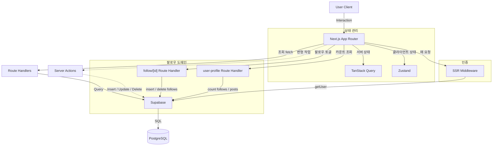
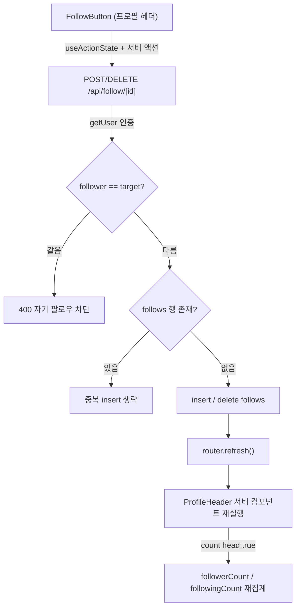
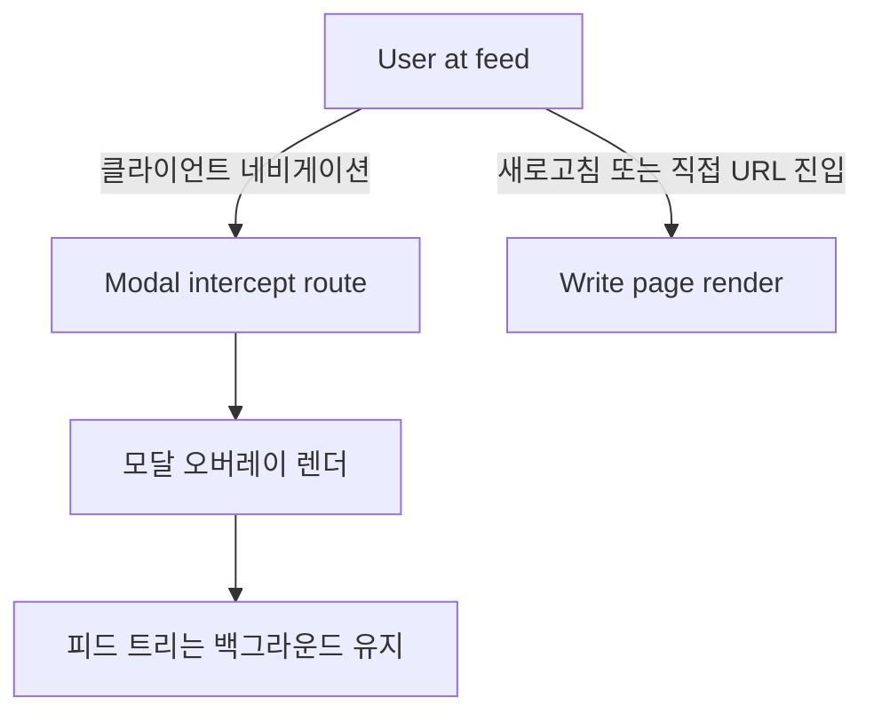
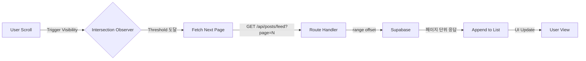

## [xAB] - 실시간 투표 및 소통 중심의 A/B 테스트 SNS

### 전체적인 아키텍처

- Next.js App Router 기반 프론트엔드와 Supabase 백엔드를 결합하여 구축했습니다.
- 조회성 요청은 클라이언트 컴포넌트가 Route Handler를 호출해 Supabase에 접근하는 경로로 처리하고, 게시글 작성·수정·삭제 같은 변형 작업은 Server Actions가 Supabase를 직접 호출하도록 두 경로를 명확히 분리했습니다.
- 서버 상태는 TanStack Query, 클라이언트 전역 상태는 Zustand로 책임을 분리해 실시간성이 중요한 SNS 환경에서도 캐시 일관성과 사용자 인터랙션 상태를 한 곳에서 추적했습니다.

### Case 1. 팔로우 토글과 프로필 카운트의 데이터 정합 설계
#### 1. 문제 원인
- 팔로우 버튼은 프로필 헤더, 팔로워 모달, 팔로잉 모달 세 위치에 나타나는데, 같은 사용자에 대한 팔로우 상태와 헤더의 Followers·Following 카운트가 한 화면 안에서 어긋날 수 있었습니다.
- 자기 자신 팔로우를 클라이언트에서만 막으면 API를 직접 호출했을 때 `follows` 테이블에 자기 참조 행이 쌓일 수 있었고, 같은 팔로우 관계를 두 번 누르면 중복 행이 생길 위험도 있었습니다.

#### 2. 해결 과정

- 팔로우 토글 Route Handler(`app/api/follow/[id]/route.ts`)에서 `supabase.auth.getUser()`로 인증을 확인한 뒤 `followerId === id`이면 400을 반환해 자기 자신 팔로우와 언팔로우를 서버에서 차단했습니다.
- POST는 `follows`에 이미 같은 `follower_id`·`following_id` 행이 있으면 insert를 건너뛰고, DELETE는 삭제된 행 수가 0이면 관계 없음 메시지를 반환하도록 분기해 중복 행과 빈 삭제를 막았습니다.
- 헤더 카운트는 `user-profile` Route Handler가 `follows`와 `posts`를 `count: 'exact', head: true`로 집계해 followerCount·followingCount·postCount를 한 응답으로 내려주고, 헤더의 팔로우 버튼은 서버 액션(`useActionState`) 처리 후 `router.refresh()`로 서버 컴포넌트를 재실행해 카운트와 버튼 상태를 같은 응답에서 다시 받도록 묶었습니다.
- 팔로워·팔로잉 모달은 `app/@modal/(.)followers`·`(.)followings` 인터셉팅 라우트로 띄우고 `@modal/default.tsx`에 빈 폴백을 두었으며, 모달 목록의 팔로우 버튼은 조회 API가 함께 내려준 `isFollowing` 값으로 초기 상태를 맞춰 프로필 헤더와 같은 기준으로 표시했습니다.

#### 3. 결과
- 자기 자신 팔로우와 중복 팔로우가 서버에서 차단되어 `follows` 테이블에 자기 참조 행이나 중복 관계가 생기지 않게 했습니다.
- 팔로우 토글 후 `router.refresh()`로 헤더 카운트와 버튼 상태가 같은 서버 응답에서 갱신되어, 프로필 헤더와 팔로워·팔로잉 모달이 같은 팔로우 상태를 보여주게 했습니다.
- **배운 점**: 팔로우 상태를 클라이언트 표시와 별개로 토글 Route Handler에서 인증·자기 참조·중복을 검증하고, 카운트는 `follows` 테이블을 `count` 집계로 다시 읽어 표시값과 실제 관계 수가 어긋나지 않도록 설계했습니다.

### Case 2. 피드 맥락을 유지하는 모달 라우팅 패턴 적용
#### 1. 문제 원인
- 피드에서 게시글 작성이나 상세 화면으로 이동할 때 전체 페이지가 다시 렌더되면서 스크롤 위치와 진행 중이던 인터랙션이 모두 초기화되는 문제가 있었습니다.
- 기존 라우팅 방식은 페이지 컨텍스트를 완전히 교체하기 때문에 이전 화면의 상태를 유지한 채 상호작용할 수 없는 구조적 한계가 원인이었습니다.

#### 2. 해결 과정

- 탐색 흐름을 유지하기 위해 피드 트리는 그대로 두고 그 위에 모달을 띄우는 방식을 채택했습니다.
- Next.js App Router의 병렬 라우트 슬롯(`@modal`)과 인터셉팅 라우트(`(.)write`)를 함께 배치하여, 클라이언트 네비게이션 시에는 모달 오버레이가 렌더되고 직접 URL 진입이나 새로고침 시에는 독립 페이지가 렌더되는 구조를 만들었습니다.
- `@modal/default.tsx`에 빈 슬롯 폴백을 두어 슬롯이 활성화되지 않은 라우트에서도 트리가 끊김 없이 렌더되도록 처리했습니다.

#### 3. 결과
- 게시글 작성과 상세 진입 시 피드 위치와 스크롤 컨텍스트가 보존되어 탐색이 끊기지 않는 경험을 제공했습니다.
- 모달 진입과 독립 페이지 진입을 같은 URL로 처리할 수 있어 공유 링크나 새로고침 시에도 일관된 화면을 보장했습니다.
- **배운 점**: 병렬 라우트 슬롯 `@modal`과 인터셉팅 라우트 `(.)write`를 조합해 클라이언트 네비게이션과 직접 URL 진입에 따라 다른 트리를 렌더하는 하이브리드 라우팅 패턴을 코드로 정리했습니다.

### Case 3. 피드 초기 로딩 지연을 해소하는 지연 로딩 전략
#### 1. 문제 원인
- 메인 피드 접속 시 게시글, 투표 옵션, 댓글 수, 좋아요 정보를 한 번에 불러오는 구조에서는 첫 화면 진입 시 응답 페이로드와 렌더링 비용이 크게 누적되었습니다.
- 뷰포트 밖에 있는 게시글까지 동일한 비중으로 페칭과 렌더링을 수행하면서 초기 화면이 그려지기까지의 체감 지연이 발생했습니다.

#### 2. 해결 과정

- 사용자가 즉시 보지 않는 데이터까지 한 번에 호출하는 대신 피드를 페이지 단위로 분할하여 호출하는 전략을 수립했습니다.
- `useInfiniteQuery`로 페이지네이션 상태를 관리하고, `react-intersection-observer`로 뷰포트 하단 트리거 요소의 노출 시점을 감지해 다음 페이지를 가져오도록 구현했습니다.
- Route Handler는 `page` 쿼리 파라미터를 받아 Supabase의 `.range(offset, offset + limit - 1)` 메서드로 페이지 단위 응답만 반환하도록 구성하여 서버와 클라이언트가 동일한 분할 단위를 공유하게 했습니다.

#### 3. 결과
- 초기 진입 시 필요한 데이터만 우선 응답하도록 변경하여 첫 화면이 그려지기까지의 체감 지연을 완화했습니다.
- 스크롤 위치에 따라 점진적으로 데이터를 채워 사용자의 탐색 흐름이 끊기지 않는 무한 스크롤 경험을 제공했습니다.
- **배운 점**: `useInfiniteQuery`와 Intersection Observer, Supabase `.range()`를 한 묶음으로 묶어 클라이언트·서버가 동일한 페이지 단위를 공유하는 무한 스크롤 구조를 정리했습니다.
