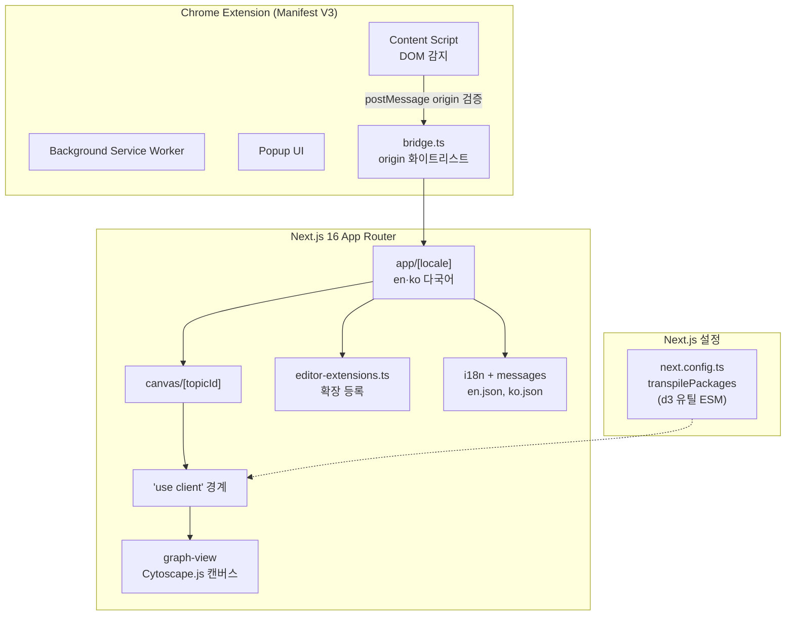
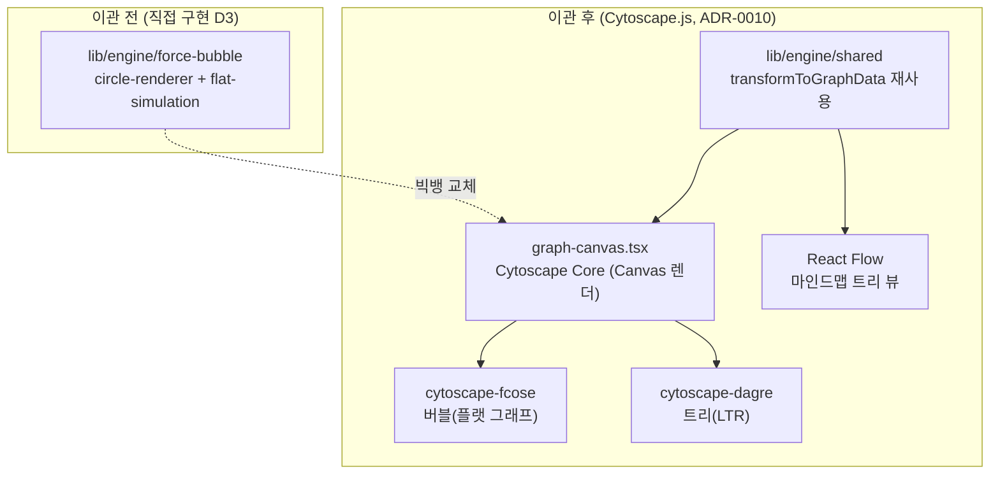
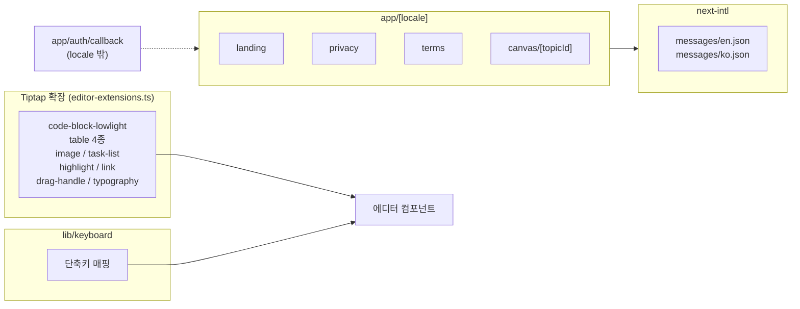
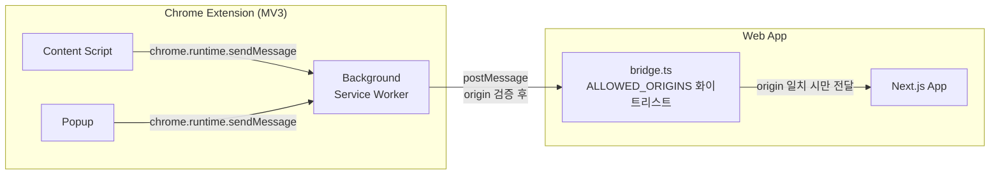

## [MindGraph] - AI 지식 캡처 & 그래프 시각화

ChatGPT·Gemini·Claude·Grok 4개 LLM 서비스의 답변을 캡처해 의미 단위로 묶고 Cytoscape.js로 시각화하는 Chrome Extension·Next.js 웹앱입니다. React 19·Next.js 16 App Router·Cytoscape.js·React Flow·Tiptap·next-intl 다국어 라우팅을 한 코드 베이스에서 다루며, Vite 3종(Service Worker·Content Script·Bridge) 빌드 설정으로 Manifest V3 Extension과 Web 사이 메시지 통신·origin 검증까지 한 시스템 안에 두었습니다.

### 전체적인 아키텍처

- **Architecture**: Server Component 경계와 `'use client'` 레이어를 분리해 Cytoscape.js 같은 Canvas/DOM 렌더 라이브러리를 한쪽에 격리하고, `[locale]` 라우팅 + en/ko 메시지로 다국어를 코드 베이스 안에서 다루며, Tiptap 확장을 `editor-extensions.ts`에 한 곳에 등록합니다(`lib/tiptap`에는 drag-handle만 별도).

### Case 1. D3 force 그래프 엔진을 Cytoscape.js로 빅뱅 이관 (ADR-0010)

#### 1. 문제 원인

- 그래프 렌더러를 D3 force 시뮬레이션과 circle-renderer로 직접 구현해, 레이아웃·줌·라벨 표시를 모두 손으로 관리하면서 유지 비용이 누적됐습니다.
- 제품 방향이 옵시디언식 플랫 그래프(탐색·발견 보조 뷰)로 바뀌고 계층 표현은 사이드바 트리가 전담하게 되면서(ADR-0009), 직접 구현한 force 엔진의 복잡도가 실제 필요보다 커졌습니다.
- D3는 SVG로 렌더해 노드가 늘면 DOM 수가 비례해 늘어나는 구조였습니다.

#### 2. 해결 과정

- **빅뱅 이관**: D3 force·circle-renderer를 제거하고 그래프 렌더링을 Cytoscape.js로 전면 교체했습니다(ADR-0010). 노드·엣지 변환 로직(`lib/engine/shared`의 `transformToGraphData`)은 재사용해 데이터 계층은 유지했습니다.
- **레이아웃 라이브러리 위임**: 버블 뷰는 `cytoscape-fcose` 포스 레이아웃, 트리 뷰는 `cytoscape-dagre` 가로 레이아웃으로, 직접 구현하던 force 계산을 라이브러리 내장 레이아웃에 맡겼습니다.
- **Canvas 렌더 + React 라이프사이클 종속**: Cytoscape는 SVG가 아닌 Canvas로 렌더하므로 `'use client'` 컴포넌트에서 `useRef`로 Cytoscape Core 인스턴스를 잡고 `useEffect` 마운트/정리에 종속시켰으며, 줌 임계에 따른 라벨 표시는 `show-label` 클래스 토글로 제어합니다.
- **트리 뷰 분리**: 계층 마인드맵은 React Flow(`@xyflow/react`)로 분리해 탐색용 그래프(Cytoscape)와 계층 트리(React Flow)를 'Network' 버튼으로 토글합니다.

#### 3. 결과

- **성과**: 직접 유지하던 D3 force·circle-renderer 코드를 제거하고 레이아웃·줌·렌더를 Cytoscape.js 내장 기능으로 위임해 그래프 렌더링 코드의 유지 범위를 줄였고, SVG 노드 누적 대신 Canvas 렌더로 전환했습니다.
- **솔직한 트레이드오프**: 빅뱅 이관 중 미니맵·마퀴 선택·유사도 오버레이는 일시 미구현 상태이며 순차 복원 중입니다(SVG 의존 오버레이는 Canvas 기준으로 재설계가 필요).
- **배운 점**: 직접 구현한 렌더 엔진을 유지할지 라이브러리에 위임할지를 제품 방향(플랫 그래프 + 트리 분리)에 맞춰 판단해, force 계산을 Cytoscape 내장 레이아웃에 넘기는 이관을 결정·실행했습니다.

### Case 2. Tiptap 에디터 확장 모듈화와 next-intl 다국어 라우팅 단일화

#### 1. 문제 원인

- 노드 본문 편집에 일반 contenteditable은 IME·붙여넣기·키보드 단축 처리가 약했고, Tiptap 기본 확장만으로는 LLM 답변에 자주 등장하는 코드 블록·표·이미지·체크리스트를 모두 다룰 수 없었습니다.
- 확장과 단축키가 컴포넌트 안에 분산되면 새 확장 추가나 통합 단축 정책 변경 비용이 누적됐습니다.
- 한국어·영어 양쪽 사용자를 받기 위해 메타데이터·랜딩·약관·인증 화면을 다국어로 제공해야 했고, 메시지를 컴포넌트에 하드코딩하면 번역 검수 시 코드 베이스 전체를 뒤져야 했습니다.

#### 2. 해결 과정

- **Tiptap 확장 모듈화**: `editor-extensions.ts`에 `code-block-lowlight`·`table` 4종·`image`·`task-list`·`highlight`·`typography` 확장을 등록하고 `drag-handle`만 `lib/tiptap`에 분리해 에디터 컴포넌트에서 import해 사용했습니다.
- **단축키 분리**: `lib/keyboard`에 단축키 매핑을 모아 에디터·캔버스·검색이 같은 단축 정책을 공유하도록 했습니다.
- **next-intl 라우트 그룹**: `app/[locale]` 동적 세그먼트 아래 `landing`·`privacy`·`terms`·`canvas/[topicId]`를 두어 모든 사용자 화면이 locale을 거치고 메시지는 `messages/{en,ko}.json` 두 JSON에서 끝나도록 했습니다.
- **OAuth 콜백 분리**: 콜백은 `app/auth/callback`을 별도 둬 locale 변경 영향을 받지 않게 해 provider 등록 URL을 ko/en별로 따로 관리하지 않도록 했습니다.

#### 3. 결과

- **성과**: 새 Tiptap 확장 추가가 `editor-extensions.ts` 등록 한 단계로 끝나고, 번역 검수는 두 JSON 파일에서 마무리되며, OAuth 콜백은 다국어 라우트와 독립적으로 동작합니다.
- **배운 점**: 확장·단축키·메시지·인증 콜백 네 가지를 각각의 단일 진입점으로 모아 새 기능 추가 시 손대야 할 파일을 한 곳으로 좁혔습니다.

### Case 3. Manifest V3 Extension과 Web 사이 메시지 통신·origin 검증

#### 1. 문제 원인

- Chrome Extension MV3에서 Web 도메인으로 Extension 카트 데이터(저장한 LLM 답변 아이템)를 넘기는 표준 경로가 없어, postMessage 기반 자체 브리지를 만들어야 했습니다.
- postMessage는 origin을 명시 검증하지 않으면 허가되지 않은 origin이 카트 데이터를 가져갈 수 있는 보안 결함이 생깁니다.
- MV3는 `eval()` 금지·외부 스크립트 동적 주입 금지 같은 CSP 제약이 있어 일반 웹앱 통신 패턴을 그대로 쓸 수 없습니다.

#### 2. 해결 과정

- **bridge.ts 화이트리스트**: 웹앱 쪽 `bridge.ts`가 `ALLOWED_ORIGINS` 상수에 허용 origin 목록을 두고, postMessage 수신 시 `event.origin`이 화이트리스트에 있을 때만 처리합니다(`SECURITY_POLICY.md §8` 강제).
- **chrome.runtime.sendMessage**: Extension 내부 통신은 `eval` 없이 안전한 `chrome.runtime.sendMessage` 채널만 사용합니다.
- **3-vite 빌드 분리**: `vite.config.extension.ts`·`vite.config.content.ts`·`vite.config.bridge.ts` 3개 vite 설정으로 Service Worker·Content Script·카트 데이터 bridge 번들 요구사항을 분리해 각 환경 보안 제약을 따로 다룹니다.
- **카트 데이터 한 방향**: Extension에서 Web 방향으로만 카트 데이터가 흐르고 역방향은 없게 해 데이터 노출 표면을 최소화했습니다.

#### 3. 결과

- **성과**: 허가되지 않은 origin이 mindgraph 카트 데이터를 가져가는 경로를 origin 화이트리스트로 차단했고, MV3 CSP 제약 안에서 Extension과 Web 사이 메시지 통신을 한 방향 흐름으로 정리했습니다.
- **배운 점**: ALLOWED_ORIGINS 화이트리스트를 bridge.ts에 두고 Service Worker·Content Script·bridge 번들을 3개 vite 설정으로 분리해, MV3 CSP 위반 없이 카트 데이터를 화이트리스트 origin으로만 전달되도록 했습니다.
