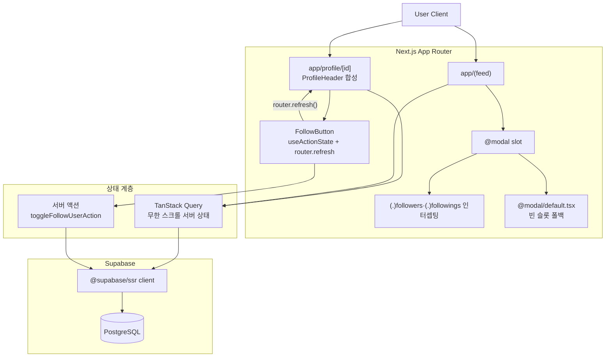
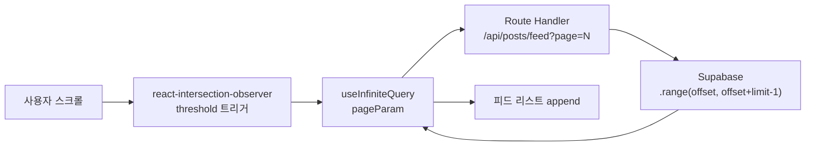
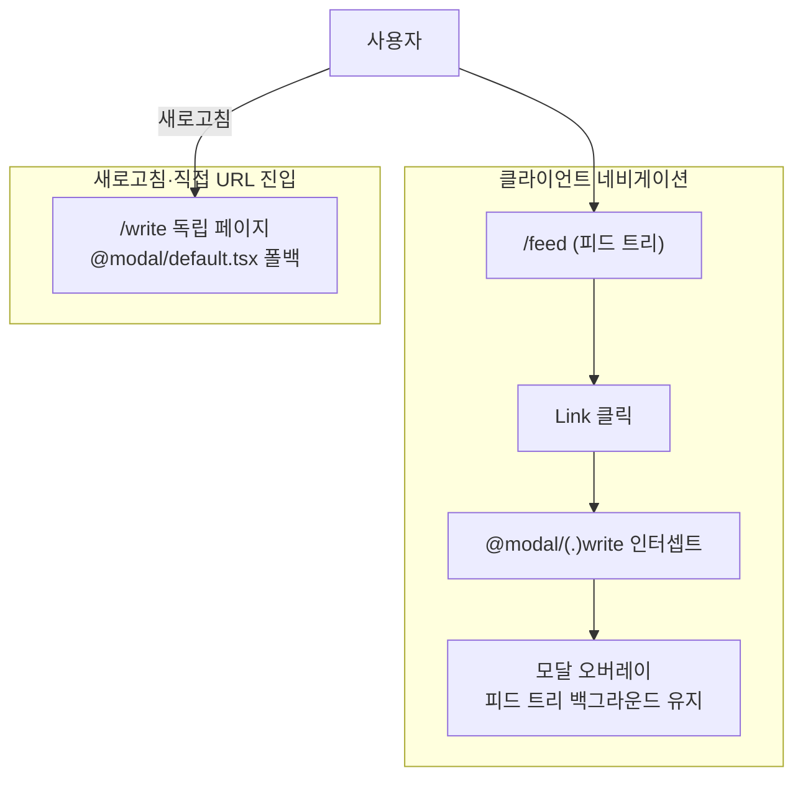
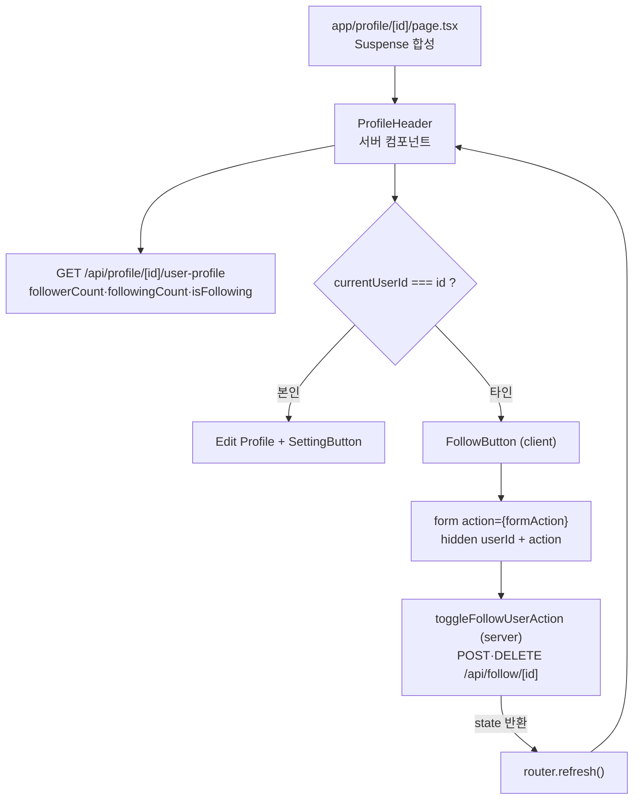
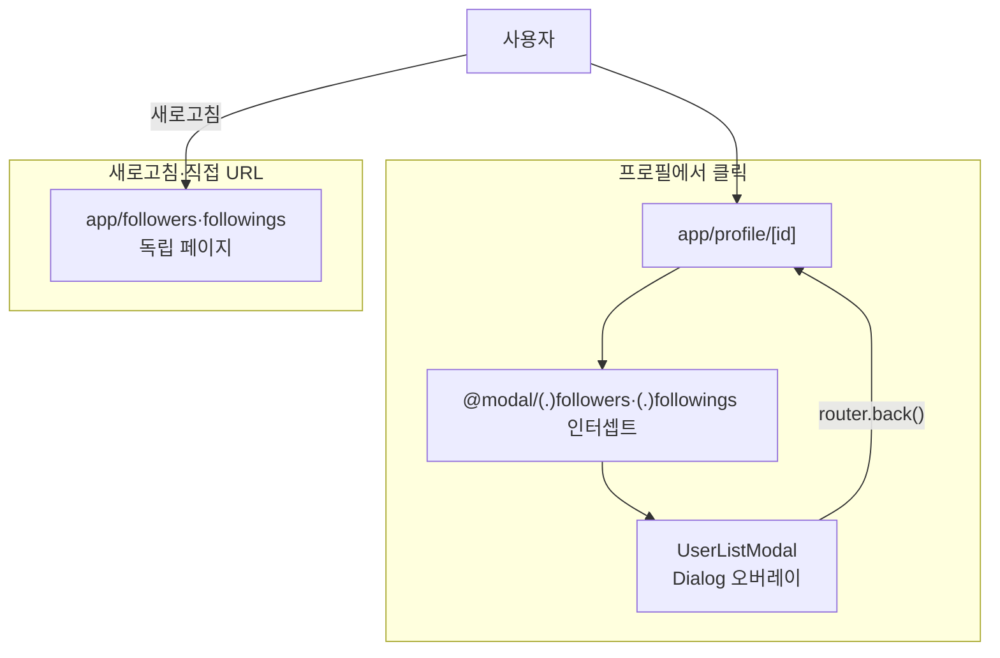

## [xAB] - 실시간 투표 및 소통 중심의 A/B 테스트 SNS

두 선택지의 실시간 투표·댓글 토론을 반영하는 SNS로, 본인은 4인 FE 팀에 참여해 프로필·팔로우 도메인과 @modal 인터셉팅 라우트 모달·useInfiniteQuery 무한 스크롤 피드를 담당했습니다.

### 전체적인 아키텍처

- **Architecture**: 병렬 라우트(`@modal`) + 인터셉팅 라우트(`(.)followers`·`(.)followings`)로 팔로워·팔로잉 모달과 독립 페이지를 같은 URL로 처리하고, 프로필 화면은 `ProfileHeader` 서버 컴포넌트가 `user-profile` 응답으로 팔로우·게시글 카운트와 `isFollowing`을 받아 렌더하며, 팔로우 토글은 `useActionState` 서버 액션 처리 후 `router.refresh()`로 카운트와 버튼 상태를 다시 페칭합니다.

### Case 1. useInfiniteQuery + Intersection Observer 무한 스크롤

#### 1. 문제 원인

- 메인 피드 접속 시 게시글·투표 옵션·댓글 수·좋아요 정보를 한 번에 불러오는 구조에서 첫 화면 진입 응답 페이로드와 렌더링 비용이 누적되었습니다.
- 뷰포트 밖 게시글까지 동일 비중으로 페칭·렌더링하면 초기 화면 그려지기까지의 체감 지연이 발생했습니다.

#### 2. 해결 과정

- **useInfiniteQuery 페이지네이션**: TanStack Query의 `useInfiniteQuery`로 페이지네이션 상태를 관리하고 `pageParam`을 다음 페이지 요청에 전달.
- **Intersection Observer 트리거**: `react-intersection-observer`로 뷰포트 하단 트리거 요소 노출 시점을 감지해 다음 페이지를 fetch.
- **Supabase range**: Route Handler가 `page` 쿼리 파라미터를 받아 `.range(offset, offset + limit - 1)`로 페이지 단위 응답만 반환하도록 서버·클라이언트 분할 단위를 일치.

#### 3. 결과

- **성과**: 초기 진입 데이터가 줄어 첫 화면 체감 지연이 완화되고, 스크롤 위치에 따라 점진적으로 데이터가 채워지는 무한 스크롤을 구현했습니다.
- **배운 점**: useInfiniteQuery + Intersection Observer + Supabase .range()를 일치시켜 초기 응답 페이로드를 페이지 단위로 줄였고 스크롤에 따라 점진적으로 채워졌습니다.

### Case 2. 병렬 라우트 슬롯(@modal) + 인터셉팅 라우트((.)write)로 모달·독립 페이지를 같은 URL로

#### 1. 문제 원인

- 피드에서 게시글 작성·상세 화면으로 이동할 때 전체 페이지가 다시 렌더되며 스크롤 위치·인터랙션이 초기화되었습니다.
- 기존 라우팅은 페이지 컨텍스트를 완전히 교체해 이전 화면 상태를 유지한 채 상호작용할 수 없는 한계가 있었습니다.

#### 2. 해결 과정

- **병렬 라우트 슬롯**: `app/@modal` 슬롯과 메인 라우트를 병렬 배치해 두 트리를 동시에 렌더링할 수 있는 구조를 만들었습니다.
- **인터셉팅 라우트**: `@modal/(.)write` 인터셉팅으로 클라이언트 네비게이션 시 모달 오버레이가 렌더, 직접 URL 진입·새로고침 시 독립 페이지가 렌더되도록 분기.
- **빈 슬롯 폴백**: `@modal/default.tsx`에 빈 슬롯 폴백을 두어 슬롯이 활성화되지 않은 라우트에서도 트리가 흐트러지지 않게 동작.

#### 3. 결과

- **성과**: 게시글 작성·상세 진입 시 피드 위치·스크롤 컨텍스트가 보존되어 탐색이 끊기지 않고, 모달·독립 페이지 진입을 같은 URL로 처리해 공유 링크·새로고침 시에도 일관된 화면을 갖췄습니다.
- **배운 점**: @modal 슬롯 + (.)write 인터셉팅을 결합해 클라이언트 네비게이션은 모달 오버레이, 새로고침·직접 URL 진입은 독립 페이지로 분기되도록 같은 URL에서 두 진입 방식을 처리했습니다.

### Case 3. 프로필 도메인 컴포넌트 합성과 서버 액션 기반 팔로우 토글 상태 동기화

#### 1. 문제 원인

- `app/profile/[id]/page.tsx`와 홈 사이드바가 같은 사용자 정보(팔로워·팔로잉·게시글 카운트, 프로필 이미지, 본인 여부)를 서로 다른 화면에서 반복 표시해, 화면마다 데이터 페칭과 본인/타인 분기를 따로 짜면 중복과 불일치가 생겼습니다.
- 팔로우 버튼을 클라이언트 상태로만 토글하면 `isFollowing`은 즉시 바뀌지만 같은 화면의 팔로워 카운트와 다른 사용자의 팔로잉 카운트는 그대로 남아, 팔로우 직후 버튼과 숫자가 어긋나는 문제가 있었습니다.

#### 2. 해결 과정

- **프로필 컴포넌트 합성**: `ProfileHeader`를 async 서버 컴포넌트로 만들어 `user-profile` API에서 팔로워·팔로잉·게시글 카운트와 `isFollowing`을 한 번에 받아 렌더하고, `page.tsx`가 이를 `Suspense`(`ProfileHeaderSkeleton` 폴백)로 감싸 `InfiniteSurveyList`와 함께 합성했습니다.
- **본인·타인 분기**: `currentUserId === id` 비교로 본인이면 `Edit Profile`·`SettingButton`, 타인이면 `FollowButton`을 렌더해 같은 헤더 컴포넌트가 두 시점을 처리하도록 했습니다.
- **서버 액션 팔로우 토글**: `FollowButton`을 `useActionState(toggleFollowUserAction, null)` 클라이언트 컴포넌트로 두고, `form` action으로 hidden `userId`와 `follow`/`unfollow` 값을 제출하면 서버 액션이 `/api/follow/[id]`에 POST·DELETE를 보내도록 했습니다.
- **router.refresh로 카운트·버튼 재동기화**: 서버 액션이 결과를 반환하면 `useEffect`에서 `router.refresh()`를 호출해 서버 컴포넌트 트리를 다시 페칭, 팔로워 카운트와 `isFollowing` 버튼 상태를 한 응답으로 맞췄습니다.

#### 3. 결과

- **성과**: 프로필 화면과 홈 사이드바가 같은 `user-profile` 응답을 쓰도록 정리해 카운트 표시 로직 중복을 없앴고, 팔로우·언팔로우 직후 버튼 라벨과 팔로워 숫자가 같은 갱신에서 함께 바뀌어 어긋남이 사라졌습니다.
- **배운 점**: 팔로우 토글을 클라이언트 상태가 아니라 서버 액션 처리 후 `router.refresh()`로 서버 컴포넌트를 재페칭하게 두니, 버튼 상태와 카운트가 한 출처에서 갱신돼 따로 동기화 코드를 둘 필요가 없었습니다.

### Case 4. @modal 인터셉팅 라우트로 팔로워·팔로잉 목록을 모달·독립 페이지로

#### 1. 문제 원인

- 프로필에서 팔로워·팔로잉 목록을 열 때 별도 페이지로 이동하면 프로필 스크롤 위치와 컨텍스트가 사라져 다시 돌아오는 흐름이 끊겼습니다.
- 목록을 모달로만 두면 공유 링크·새로고침으로 직접 진입했을 때 모달 단독으로는 화면이 성립하지 않는 문제가 있었습니다.

#### 2. 해결 과정

- **인터셉팅 라우트 모달**: `@modal/(.)followers`·`@modal/(.)followings`로 프로필에서 클릭한 팔로워·팔로잉 목록을 `UserListModal` Dialog 오버레이로 띄우고, 닫을 때 `router.back()`으로 프로필로 복귀.
- **독립 페이지 폴백**: 같은 목록을 `app/followers`·`app/followings` 독립 라우트에도 두어 새로고침·직접 URL 진입 시 같은 모달 컴포넌트가 전체 페이지로 렌더되도록 분기.
- **빈 슬롯·목록 검색**: `@modal/default.tsx`로 슬롯 비활성 라우트의 트리를 보존하고, 모달 안 `SearchBar`로 `/api/profile/[id]/followers`·`followings` 응답을 username 기준으로 필터링.

#### 3. 결과

- **성과**: 프로필에서 팔로워·팔로잉을 열 때 프로필 스크롤·컨텍스트가 보존된 채 모달이 뜨고, 공유 링크·새로고침으로 같은 URL에 직접 들어와도 독립 페이지로 동일한 목록이 렌더됩니다.
- **배운 점**: 인터셉팅 라우트 모달과 독립 라우트를 같은 `UserListModal`로 묶어 클라이언트 네비게이션은 오버레이, 직접 진입은 전체 페이지로 한 URL에서 두 진입을 처리했습니다.
